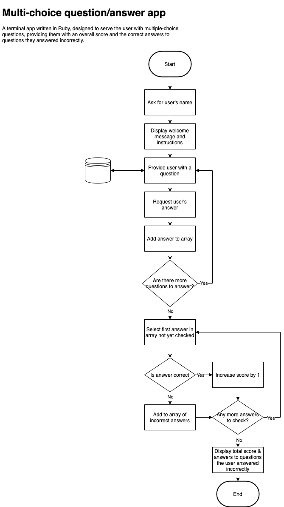

# Trivia Time - Ruby Terminal App

by Mike Olivotto

## About the app

### Description

This is a multiple-choice trivia app testing users on their knowledge of a given topic. The difficulty of the questions can be adjusted by selecting from easy, regular, and hard modes, and users can view both their score and corrections for questions they answered incorrectly.

#### The problem

Administering trivia games can be time consuming for markers comparing answers, and thus prone to human error. On the other hand players want feedback to improve their knowledge, and the timelier the feedback the better. This app solves all these problems by automating all the associated tasks and providing instant feedback.

#### Audience

The app is primarily designed with trivia enthusiasts and trivia hosts in mind, however test administrators & test takers (such as in a school setting) could be considered a secondary audience that would find value in this app due to the very closely related tasks in both settings.

#### General usage

Upon loading the app, the user will be prompted to enter their name and the desired difficulty level of the questions. At this point the user will be delivered a predetermined number of questions matching the requested difficulty level, for which they will select an answer from multiple choices using their keyboard to navigate the options.

\- **describe** at a high level what the application will do
\- **identify** the problem it will solve and **explain** why you are developing it
\- **identify** the target audience
\- **explain** how a member of the target audience will use it

300-500 words

### Features

**Develop** a list of features that will be included in the application. It must include:
\- at least THREE **features**
\- **describe** each feature

**Note:** **Ensure** that your features above allow you to demonstrate your understanding of the following language elements and concepts:
\- use of variables and the concept of variable scope
\- loops and conditional control structures
\- error handling

**Consult with your educator** to check your features are sufficient .

300 words (approx. 100 words per feature)

## How to use the app

**Develop** an **outline** of the user interaction and experience for the application.
Your outline must include:
\- how the user will find out how to interact with / use each feature
\- how the user will interact with / use each feature
\- how errors will be handled by the application and displayed to the user

## Design & Planning Process

### Ideation

not sure whether to elaborate on this, or if it is even necessary

### Flow chart

**Develop** a diagram which describes the control flow of your application. Your diagram must:
\- show the workflow/logic and/or integration of the features in your application for each feature.
\- utilise a recognised format or set of conventions for a control flow diagram, such as UML.

## App creation

**Develop** an implementation plan which:
\- **outlines** how each feature will be implemented and a checklist of tasks for each feature
\- prioritise the implementation of different features, or checklist items within a feature
\- provide a deadline, duration or other time indicator for each feature or checklist/checklist-item

Utilise a suitable project management platform to track this implementation plan

\> Your checklists for each feature should have at least 5 items.

**Create a TRELLO BOARD**

## Installation & Usage Instructions

**Design** help documentation which includes a set of instructions which accurately **describe** how to use and install the application.

You must include:
\- steps to install the application
\- any dependencies required by the application to operate
\- any system/hardware requirements

### Dependencies

- Artii
- Colorize
- TTY-prompt
- TTY-box
- Json