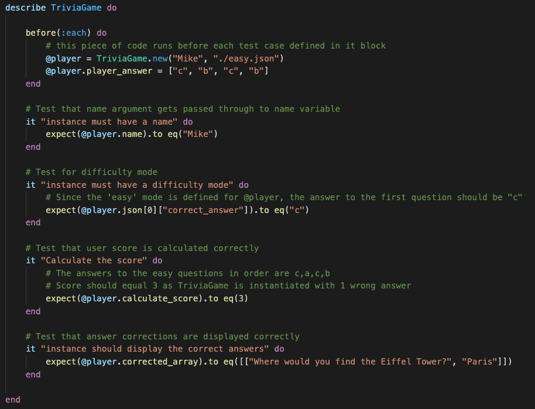

# Trivia Time - Ruby Terminal App

by Mike Olivotto - GitHub repo: https://github.com/mikeolivotto/t1a3

## About the app

This is a multiple-choice trivia app testing users on their knowledge of a given topic. The difficulty of the questions can be adjusted by selecting from easy, regular, and hard modes, and users can view both their score and corrections for questions they answered incorrectly.

#### The problem

Administering trivia games can be time consuming for markers comparing answers, and thus prone to human error. On the other hand players want feedback to improve their knowledge, and the timelier the feedback the better. This app solves all these problems by automating all the associated tasks and providing instant feedback.

#### Audience

The app is primarily designed with trivia enthusiasts and trivia hosts in mind, however test administrators & test takers (such as in a school setting) could be considered a secondary audience that would find value in this app due to the very closely related tasks in both settings.

#### General usage

Upon loading the app, the user will be prompted to enter their name and the desired difficulty level of the questions. At this point the user will be delivered a predetermined number of questions matching the requested difficulty level, for which they will select an answer from multiple choices using their keyboard to navigate the options.

### Features

1. **Three difficulty modes**
   To ensure the app is engaging to all levels of trivia fans, 3 different modes of difficulty have been created. Question difficulty can range from easy to regular, or hard. Questions are stored in JSON files, one file per difficulty level and the difficulty level is determined by the user prior to beginning the game. `if` logic is used to take the user's selection and have the app pull data from the corresponding file.

   
   

2. **Questions w/ multiple-choice answers**
   The foundation of the app, a series of questions are displayed to the user, each with a selection of possible answers for the user to choose from. The user can then select the answer using arrow keys, preventing any potential mishaps that can come from free text entry.
   Loops are used to cycle through the array of questions in the JSON file.

   
   

3. **Display user score**
   Naturally, the user will want to know how they performed. Upon completion of all questions the user has the ability to check their score, displayed as the number of correctly answered questions out of the total number of questions.
   An instance variable that is used to collect the user's answers is referred to while this feature of the application cycles through the answers, and then increments a different instance variable that collects the score.

   
   

4. **Display correct answers**
   As a complementary feature to user score, the application can also display the correct answers to the questions that the user answered incorrectly. If the user decides to use this feature, they will be displayed with both the question and the correct answer.
   An instance variable that is used to collect the user's answer for each question is also referred to as the application cycles through the answer list to pull out the relevant questions and answers.

   
   

## User Interaction & Experience

The app has been purposefully designed to be intuitive for any user. Once the app is loaded, users are prompted every step of the way with clear instructions on expected input. Even prior to running the application, the user can use the `-h` or `--help` flags to display instructions.

### Inputs & Error Handling

The first input required is for the user to enter their name using a free-text input. If the user attempts to proceed without entering a name (ie. the user simply presses Enter when prompted for a name) a custom exception is thrown and the error is handled/rescued by informing the user that name cannot be left empty, and asking them to try again.

All other inputs are handled by the Ruby gem, TTY-Prompt. Users are presented with multiple choices and instructions are displayed on screen informing them how to make their selection (Press ↑/↓ arrow to move and Enter to select).

## Design & Planning Process

### Flow chart

### Planning & Implementation

Trello was utilised as the project management tool of choice during planning and implementation of the app ([Board here](https://trello.com/b/6wkeTboD/terminal-app)). The board uses a simplified and slightly modified version of kanban, with the following headings:

- User stories - for quick reference while building out features
- Backlog - for all the additional features/tweaks that came to mind during build
- To Do
- Doing
- Done

In addition, labels were used to help prioritise tasks, assigning a range between low, medium and high for both priority and time estimated per task, as well as a label specifically for any bugs encountered.

### Testing

RSpec has been employed as the testing method of choice. Tests have been designed to cover four major features:

* The instance must have a name
* The instance must have a difficulty mode selected and load the corresponding JSON file
* Calculate the score based on number of correct answers
* Pull out questions the user answered wrong and provide the correct answer

The tests instantiate a game with the name of "Mike" and the 'easy' mode file selected. It also runs a test case based on 3 correct answers and 1 incorrect. The expected results for each test can be seen by viewing the `trivia_app_spec.rb` file in the `/spec` folder.

## Installation & Usage Instructions

Ruby is required to run this application. [Download Ruby here.](https://www.ruby-lang.org/en/downloads/) 

You will also need to have the Bundler Gem installed on your machine; if you do not have it enter the command `gem install bundler`

### Installation

1. Begin by forking or cloning this repo to your local machine.
2. Install the app from the root directory (`/src`) with the  command `./install.sh `

### Running the app

Run the app: `./trivia.sh`

The app can be run with up to 3 arguments, in any order:

- `-h` or `--help` to view the help instructions
- The player's first name*
- `easy`, `regular` or `hard` to nominate question difficulty mode*

**Notes**: 

- Entering multiple names or difficulty modes will result in the application only accepting the last argument for either 
  - eg. `ruby index.rb Mike O easy hard` would result in the programming recognising player name as 'O' and the difficulty level as hard.
- The application can be run without including arguments at run time. The application will prompt you for these upon starting.

###  Usage

All answers and options can be selected by pressing the ↑/↓ arrows to move and Enter to select.

### System and Hardware requirements

This application has been designed and tested to run on MacOS 11.2.3, but should run on any Ruby-capable machine. Users obviously need a monitor (to see the app) and keyboard (for user input).

The application also relies on the following Ruby Gem dependencies:

- [Artii](https://rubygems.org/gems/artii/versions/2.1.2)
- [Colorize](https://github.com/fazibear/colorize)
- [TTY-prompt](https://github.com/piotrmurach/tty-prompt)
- [TTY-box](https://github.com/piotrmurach/tty-box)

[RSpec](https://rspec.info/) is included for development testing purposes, however this gem is not necessary for the functioning of the app.

## Acknowledgments & Credits

The following sources provided useful information, tools and /or inspiration in the development of this application:

- Brandon J, 2020, *Ruby Error Handling,* Academy of Information Technology  - error handling in the app adapted from this video
- Cristina Murilli's [Medium article](https://medium.com/@cristina_9416/my-first-ruby-cli-app-8804058df294) on her first Ruby CLI app provided some excellent ideas, especially the use of `sleep()`
- The creators of the gems listed above